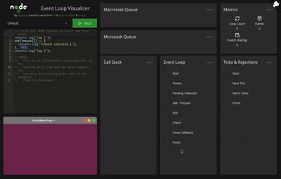

# Node.js EventLoop Visualizer



Try it out! [Node-Event-Loop](https://vagostep.github.io/Node-EventLoop-Visualizer/)

This Event Loop Visualizer shows the phases that an Event Loop makes when executing Javascript code. The server captures the traces at runtime and then, it returns them to the visualizer.

### What's new?

* Added feature to support actual Node.js Event Loop & processTicksAndRejections traces
* Added better visualization of Node.js' Event Loop phases
* Added a visualizer of the processTicksAndRejections loop
* Added a "terminal" to print logs with an Ubuntu skin
* New examples and descriptions


# Dependencies 

* The repo for the Node.js modified source code is [here](https://github.com/vagostep/Node-EventLoop-Visualizer-Node)

## How to set up node?

You need to compile the Node.js modified project. Then you need to copy the file from `/out/Release/node` to `server/node/node` 

# How to run it?

### Client

```
cd client
npm install
npm run start
```

### Server

```
cd server
npm install
npm run start
```

# Supported Features

* Promise.resolve().then()
* Promise.reject().catch()
* new Promise((resolve) => resolve()).then 
* process.nextTick()
* queueMicrotask()
* setTimeout()
* setInterval() (You need to add a clearInterval() at some point to spot the execution)
* fs.readFile()
* setImmediate()

# Issues

If you find any issue, please open a new issue

# Feature Requests

If you want to test some functionality that is not supported yet, please open a ticket request.

# Acknowledgments

This repo is an improvement of the wonderful work made by 
<table>
  <tr>
    <td align="center">
      <a href="https://github.com/PhakornKiong">
        
      </a>
      <br />
      <a href="https://github.com/PhakornKiong">PhakornKiong</a>
    </td>
    <td align="center">
      <a href="https://github.com/Hopding">
        
      </a>
      <br />
      <a href="https://github.com/Hopding">Hopding</a>
    </td>
    <td align="center">
      <a href="https://github.com/latentflip">
        
      </a>
      <br />
      <a href="https://github.com/latentflip">latentflip</a>
    </td>
    <td align="center">
      <a href="https://github.com/thedull">
        
      </a>
      <br />
      <a href="https://github.com/thedull">thedull</a>
    </td>
  </tr>
</table>

### Client Forked from [PhakornKiong/Node-EventLoop-Visualizer-Client](https://github.com/PhakornKiong/Node-EventLoop-Visualizer-Client)

### Server Forked from [PhakornKiong/Node-EventLoop-Visualizer-Server](https://github.com/PhakornKiong/Node-EventLoop-Visualizer-Server)

